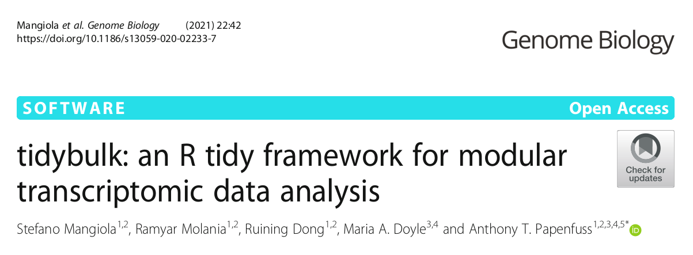
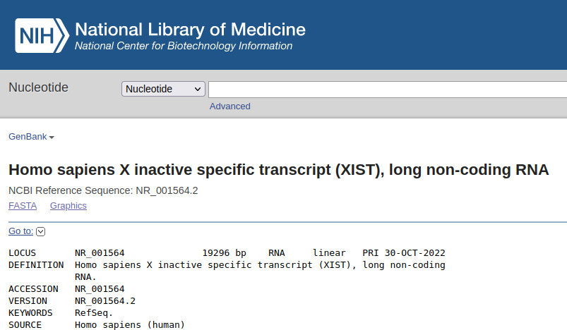

```{r setup, include=FALSE}
knitr::opts_chunk$set(echo = FALSE)
```

## Differential gene expression

**Differential Expression** (DE) performing statistical analysis to
discover quantitative changes in expression levels between experimental
groups.

## Tidybulk

Tidybulk is a Bioconductor package that takes together the methods from
three popular DE (edgeR, DESeq2 and limma) and simplifies the analysis

{width=100%}

## The pipeline

1.  Load libraries
2.  Load tables
3.  Prepare dataset
4.  Inspect pre-normalization
5.  Normalize
6.  Inspect post-normalization
7.  Differential expression

## The dataset

{width="100%"}

Only chromosome X

## The samples

{height="30%"}

## 1 - Load libraries

```{r libraries, echo = TRUE, message = FALSE}
library(tidybulk)
library(tidyverse)
```

In that order. If not, tidybulk complains.

## 2 - Load tables

## Sample metadata

```{r load_sample, echo = TRUE, message = FALSE}
sample_metadata <- 
  read_csv("data/reference/geuvadis_phenodata.csv") %>% 
  rename(sample = ids)
```


```{r sample_metadata, echo = FALSE}
sample_metadata %>% head() %>% knitr::kable()
```

## Feature (gene) metadata

```{r load_feature, echo = TRUE, message = FALSE}
feature_metadata <- 
  read_tsv("results/gene_annotation.tsv")
```

```{r echo = FALSE}
feature_metadata %>% head() %>% knitr::kable()
```

## Load counts

```{r load_counts, message=FALSE}
counts <- read_tsv("results/counts.tsv")
```

```{r counts, echo = FALSE}
counts %>% head() %>%  knitr::kable()
```

## 3 - Prepare dataset

```{r prepare_dataset, message=FALSE}
counts <-
  counts %>%
  left_join(sample_metadata) %>%
  tidybulk(sample, gene, counts)
```

```{r show_dataset, echo = FALSE}
counts %>% head() %>% knitr::kable()
```

## 4 - Explore dataset

We can inspect thousands of genes in a single 2-dimensional plot so we
need to apply a dimension reduction method.

Tidybulk comes with three:

- PCA: Principal Component Analysis (1901)
- MDS: Multi-Dimensional Scaling (2001?)
- t-SNE: t-distributed Stochastic Neighbor Embedding (2008)

## 4.1 PCA

```{r pca_pre, echo = TRUE}
pca <-
  counts %>%
  identify_abundant() %>%
  reduce_dimensions(method = "PCA")
```

## PCA by sex

```{r pca_pre_sex, echo = TRUE}
ggplot(pca, aes(x = PC1, y = PC2, color = sex)) +
  geom_point()
```

## PCA by population

```{r pca_pre_population, echo = TRUE}
ggplot(pca, aes(x = PC1, y = PC2, color = population)) +
  geom_point()
```

## 4.2 MDS

```{r mds_pre, echo = TRUE}
mds <-
  counts %>%
  identify_abundant() %>%
  reduce_dimensions(method = "MDS")
```

## MDS by sex

```{r mds_pre_sex, echo = TRUE}
ggplot(mds, aes(x = Dim1, y = Dim2, color = sex)) +
  geom_point()
```

## MDS by population

```{r mds_pre_population, echo = TRUE}
ggplot(mds, aes(x = Dim1, y = Dim2, color = population)) +
  geom_point()
```

## 4.3 t-SNE (inssuficient samples)

```{r tsne_pre, echo = TRUE, error = TRUE}
tsne <-
  counts %>%
  identify_abundant() %>%
  reduce_dimensions(method = "tSNE")
```

## 5. Normalize data

Normalizations consists of:

- Removing genes with low expression (in all or a group of samples)
- Take into account the library sizes
- Add, remove and scale the counts

to make the values comparable between groups

## Normalize with tidybulk

```{r normalize, echo = TRUE}
counts_normalized <-
  counts %>%
  identify_abundant(
    factor_of_interest = sex,
    minimum_counts = 2,
    minimum_proportion = 0.7
  ) %>%
  keep_abundant(factor_of_interest = sex) %>%
  scale_abundance() %>%
  adjust_abundance(~ sex + population)
```

##
```{r normalize_show, echo = FALSE}
counts_normalized %>% 
  select(
    sample, gene, counts, counts_scaled, counts_scaled_adjusted, .abundant
  ) %>% 
  head() %>% 
  knitr::kable()
```


## Plot normalization

```{r prepare_normalization, echo = FALSE}
data_normalization <-
  counts_normalized %>%
  pivot_longer(
    c(counts, counts_scaled, counts_scaled_adjusted),
    values_to = "count",
    names_to = "normalization"
  )
```


```{r plot_normalization, echo = FALSE}
plot_normalization <-
  data_normalization %>%
  ggplot(aes(count + 1, color = sample)) +
  geom_density(na.rm = TRUE) +
  scale_x_log10() +
  facet_grid(~normalization)
```

## Normalization

```{r plot_normalizatiom, echo = FALSE}
plot_normalization
```


## 6. Inspect again the data

## 6.1 PCA - Sex

```{r plot_pca_post_sex, echo = TRUE, message = FALSE}
counts_normalized %>%
  reduce_dimensions(method = "PCA") %>% 
  ggplot(aes(x = PC1, y = PC2, color = sex)) +
  geom_point()
```

## 6.2 PCA - Population

```{r plot_pca_post_population, echo = FALSE, message = FALSE}
counts_normalized %>%
  reduce_dimensions(method = "PCA") %>% 
  ggplot(aes(x = PC1, y = PC2, color = population)) +
  geom_point()
```

## 6.2 MDS

```{r plot_mds_post_sex, echo = TRUE, message = FALSE}
counts_normalized %>%
  reduce_dimensions(method = "MDS") %>% 
  ggplot(aes(x = Dim1, y = Dim2, color = sex)) +
  geom_point()
```

## 7. Differential expression

```{r de, echo = TRUE, message=FALSE}
differential_expression <-
  counts_normalized %>%
  test_differential_abundance(
    ~ 0 + sex + population,
    contrasts = "sexfemale - sexmale"
  ) %>%
  pivot_transcript()
```

## 

```{r, echo = FALSE}
differential_expression %>% head() %>% 
  knitr::kable()
```

## Prepare data for plot

```{r de_prepare}
data_de_plot <-
  differential_expression %>%
  rename(
    logFC  = `logFC___sexfemale - sexmale`,
    logCPM = `logCPM___sexfemale - sexmale`,
    Fvalue = `F___sexfemale - sexmale`,
    PValue = `PValue___sexfemale - sexmale`,
    FDR    = `FDR___sexfemale - sexmale`
  ) %>%
  mutate(
    significant = FDR < 0.05 & abs(logFC) > 1.2,
    direction = sign(logFC),
    label = if_else(significant, gene,  NA_character_),
    color = if_else(significant, "red", "black")
  )
```

## 

```{r, echo = FALSE}
data_de_plot  %>% head() %>% knitr::kable()
```

## 7.1 MA-plot (logCPM vs logFC)

```{r ma_prepare, echo = TRUE, message= FALSE}
ma_plot <-
  data_de_plot %>%
  ggplot(aes(
    x = logCPM, y = logFC,
    label = label,
    color = color,
    size = significant,
    alpha = significant
  )) +
  geom_point() +
  ggrepel::geom_text_repel()
```

##

```{r, echo = FALSE, message = FALSE, warning = FALSE}
ma_plot
```

## 7.2 Volcano plot (logFC vs FDR)

```{r volcano_prepare, echo = TRUE}
volcano_plot <-
  data_de_plot %>%
  ggplot(aes(
    x = logFC, y = FDR, 
    label = label, 
    color = color,
    size = significant,
    alpha = significant
  )) +
  geom_point() +
  ggrepel::geom_text_repel() +
  scale_y_continuous(trans = "log10_reverse")
```

##

```{r volcano_plot, echo = FALSE, message = FALSE, warning=FALSE}
volcano_plot
```

## Identify the gene differentially expressed

```{r de_gene, message = FALSE}
data_de_plot %>%
  left_join(feature_metadata) %>%
  filter(significant) %>% 
  knitr::kable()
```

## Xist



## 


